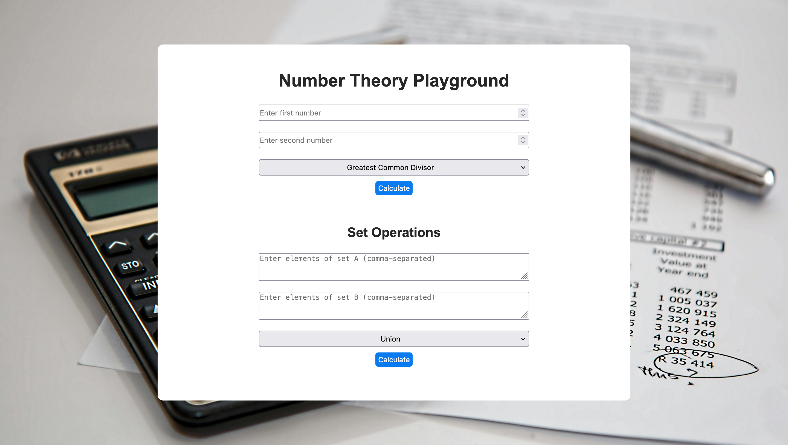

# Number Theory Playground

This project is a web application designed to explore various number theory concepts and set operations. It provides functionalities such as calculating the Greatest Common Divisor (GCD), Least Common Multiple (LCM), prime numbers, modular arithmetic, and set operations including union, intersection, and difference.



## Table of Contents

- [Features](#features)
- [Getting Started](#getting-started)
- [Usage](#usage)
- [Contributing](#contributing)
- [License](#license)

## Features

- Calculate GCD and LCM of two numbers.
- Find prime numbers between two given numbers.
- Perform modular arithmetic operations.
- Conduct set operations including union, intersection, and difference.

## Getting Started

To get a local copy up and running follow these simple steps:

1. Clone the repository:
   ```bash
   git clone https://github.com/Damilordz/number-theory-playground.git
   
2. Navigate into the project directory:
    ```bash
    cd number-theory-playground
3. Open the index.html file in your web browser.

## Usage
1. Enter the required input values (numbers or sets) in the designated input fields.
2. Select the desired operation from the provided options.
3. Click the "Calculate" button to perform the selected operation.
4. The result will be displayed on the web page, along with an explanation of the operation.

## Contributing

Contributions to this project are welcome! If you find any issues or have suggestions for improvements, please open an issue or submit a pull request.
